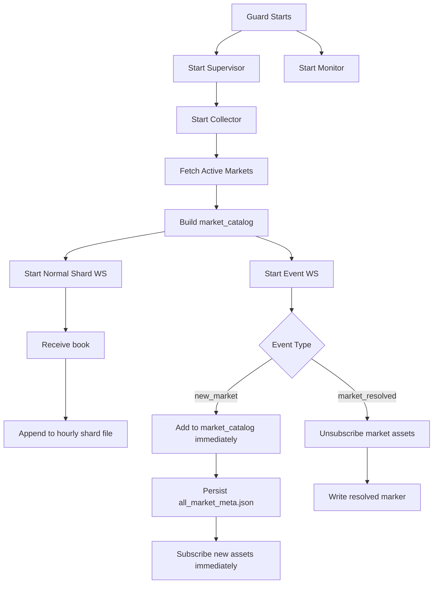

# Current Collector Workflow
启动json采集版本的脚本进程，资源监控进程
webscoket推送price_change和book两种事件，现在这个脚本只记录了book推送，将price_change也记录上。然后启动采集和资源监控脚本
启动json采集的脚本进程，资源监控进程，运行5分钟后统计这个采集脚本的内存需求，磁盘需求，网络带宽需求情况，并估计天/月的磁盘需求，如果按代码中的方式压缩，压缩后的天/月的磁盘需求。以及如果我部署在服务器上运行，服务器的内存，cpu（几核几线程）才足够支持这个采集脚本的运行。

This version optimizes for low CPU usage.

The collector no longer aligns rows across assets and no longer writes custom binary book files.
Instead, it writes each received `book` record into an hourly shard file under `books/`,
and each received `price_change` entry into an hourly shard file under `price_changes/`.

## Scripts

- `books_guard.py`
  - Top-level guard.
  - Keeps `supervisor` and `monitor` alive.
- `supervise_books_collector.py`
  - Restarts the collector if it exits.
- `stream_all_books_files.py`
  - Main collector.
  - Fetches active markets at startup.
  - Maintains websocket connections.
  - Writes append-only hourly shard JSONL history for `book` and `price_change`.
  - Handles `new_market` and `market_resolved`.
- `monitor_books_runtime.py`
  - Records CPU, memory, process I/O, and data directory growth.
- `decode_books_samples.py`
  - Reads either legacy per-market `books.jsonl` or the new sharded layout and prints readable samples.

## Storage Model

The current design intentionally trades storage efficiency for lower CPU cost:

- no timestamp alignment across assets
- no zero-row backfilling
- no binary packing
- no per-market live file fanout

It still applies two production-oriented reductions compared with the old per-market JSONL layout:

- fixed hourly partitioning
- fixed shard fanout per hour, for example `32` or `64`
- compact field names plus integer scaling for price and size fields

Each received `book` and each individual `price_change` entry are appended in compact JSONL form.

## Startup Flow

1. Fetch current active markets from Gamma:
   - `active=true`
   - `closed=false`
   - `archived=false`
2. Build in-memory `market_catalog`
3. Persist metadata to `all_market_meta.json`
4. Append catalog bootstrap entries into `state/market_catalog.jsonl` when needed
5. Extract all active `asset_id` values
6. Split assets into websocket shards
7. Start websocket listeners and the JSONL writer

## Websocket Layout

### Normal shard connections

- `custom_feature_enabled: false`
- Subscribe by `asset_id`
- Responsible for normal market data flow
- Persist `book` and `price_change`

### Dedicated event connection

- `custom_feature_enabled: true`
- Subscribes only a few anchor assets
- Responsible for:
  - `new_market`
  - `market_resolved`

Default anchor count:

- `--event-anchor-assets=3`

## `new_market` Handling

The collector fully trusts `new_market`.

When a `new_market` event arrives:

1. Build `MarketMeta` directly from the event payload
2. Assign a permanent `market_index` if the market has never been seen before
3. Insert or update it in in-memory `market_catalog`
4. Append the change into `state/market_catalog.jsonl`
5. Persist the updated snapshot to `all_market_meta.json`
6. Assign the new `asset_id` values to normal shard connections
7. Send websocket `subscribe` immediately

There is no delayed validation or hourly reconciliation.

## `market_resolved` Handling

When a `market_resolved` event arrives:

1. Mark the market as resolved inside `market_catalog`
2. Remove its assets from shard subscriptions
3. Append the resolved state into `state/market_catalog.jsonl`
4. Persist the updated snapshot
5. Stop further collection for that market
6. Write a resolved marker into:
   - `resolved_market/<market_id>.json`
7. If a legacy per-market directory still exists from an older layout, archive it into:
   - `resolved_market/<market_id>.tar.xz`
8. Shared hourly shard files remain in place

Archive content:

- in the new layout, only a resolved marker is written because market records are mixed into shared shard files
- if a legacy live market directory exists, it is archived before deletion

## Storage Layout

```text
<data-root>/
  all_market_meta.json
  state/
    market_catalog.jsonl
  books/
    dt=YYYY-MM-DD/
      hour=HH/
        shard-0000.jsonl
        ...
  price_changes/
    dt=YYYY-MM-DD/
      hour=HH/
        shard-0000.jsonl
        ...
  resolved_market/
    <market_id>.json
    <market_id>.tar.xz   # only when a legacy market directory exists
```

Each market is assigned:

- a permanent `market_index`
- a stable `write_shard`
- a `resolved` flag that is kept after market close

These are stored in `all_market_meta.json`. Changes are also appended to `state/market_catalog.jsonl`.
The shard files contain many markets, but a given market always lands in the same shard number across hours.

## `books/.../shard-XXXX.jsonl` Format

Each line is one compact received `book` row, written in append-only form.

Current compact fields:

- `m`
  - `market_index`
- `i`
  - `asset_index`
- `t`
  - `timestamp_ms`
- `b`
  - bids as `[[price_int,size_int], ...]`
- `a`
  - asks as `[[price_int,size_int], ...]`

Scaling:

- price fields use `price_scale=1_000_000`
- size fields use `size_scale=100`

Fields such as:

- `market`
- `asset_id`
- `tick_size`
- `event_type`
- hour partition
- shard id

are not repeated in every line anymore. They are derived from the file path and `all_market_meta.json`.

## `price_changes/.../shard-XXXX.jsonl` Format

Each line is one compact received `price_change` entry, written in append-only form.

Current compact fields:

- `m`
  - `market_index`
- `i`
  - `asset_index`
- `t`
  - top-level websocket timestamp in milliseconds
- `p`
  - `price` scaled by `1_000_000`
- `s`
  - `size` scaled by `100`
- `y`
  - side code: `1=BUY`, `2=SELL`
- `bb`
  - `best_bid` scaled by `1_000_000`
- `ba`
  - `best_ask` scaled by `1_000_000`
- remaining unknown keys
  - copied through if present

The websocket payload arrives as one `price_change` message containing a `price_changes[]` array.
The collector expands that array and writes one JSONL line per entry.

## Why This Uses Less CPU

Compared with the previous aligned binary format, this version avoids:

- sorting by timestamp within each market batch
- expanding one timestamp into rows for every asset in the market
- writing empty rows for non-updated assets
- repeated binary struct encoding
- per-market live file fanout

The main write path now does:

1. group incoming market events by `hour + write_shard + dataset`
2. append compact `book` rows to `books/dt=.../hour=.../shard-XXXX.jsonl`
3. append expanded compact `price_change` rows to `price_changes/dt=.../hour=.../shard-XXXX.jsonl`

This increases storage usage, but lowers CPU significantly.

## Runtime Recovery

### Inside the collector

- websocket reconnect
- idle reconnect
- retry on initial market fetch failure

### Outside the collector

- `supervise_books_collector.py` restarts the collector process
- `books_guard.py` restarts `supervisor` and `monitor`
- startup task scripts can relaunch the whole stack after reboot

## Flowchart


