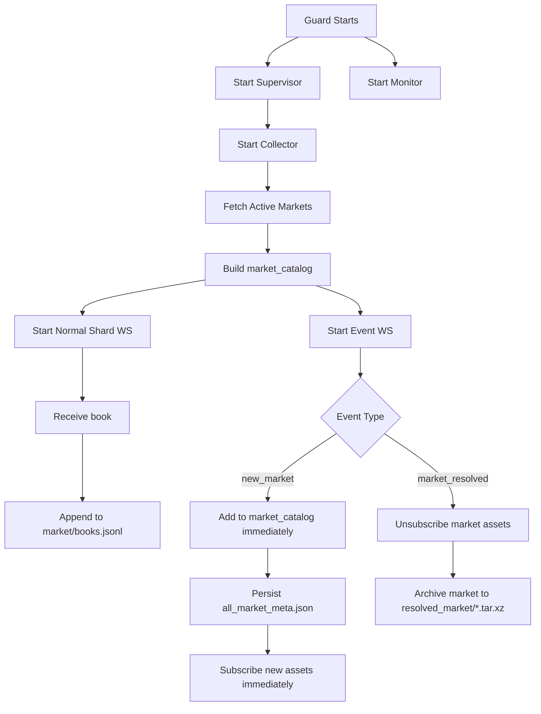

# Current Collector Workflow

This version optimizes for low CPU usage.

The collector no longer aligns rows across assets and no longer writes custom binary book files.
Instead, it writes each received `book` record directly into per-market `books.jsonl`.

## Scripts

- `books_guard.py`
  - Top-level guard.
  - Keeps `supervisor` and `monitor` alive.
- `supervise_books_collector.py`
  - Restarts the collector if it exits.
- `stream_all_books_files.py`
  - Main collector.
  - Fetches active markets at startup.
  - Maintains websocket connections.
  - Writes append-only JSONL book history.
  - Handles `new_market` and `market_resolved`.
- `monitor_books_runtime.py`
  - Records CPU, memory, process I/O, and data directory growth.
- `decode_books_samples.py`
  - Reads `books.jsonl` and prints readable samples.

## Storage Model

The current design intentionally trades storage efficiency for lower CPU cost:

- no timestamp alignment across assets
- no zero-row backfilling
- no custom numeric encoding
- no per-record Decimal scaling
- no binary packing

Each received `book` is appended almost as-is.

## Startup Flow

1. Fetch current active markets from Gamma:
   - `active=true`
   - `closed=false`
   - `archived=false`
2. Build in-memory `market_catalog`
3. Persist metadata to `all_market_meta.json`
4. Extract all `asset_id` values
5. Split assets into websocket shards
6. Start websocket listeners and the JSONL writer

## Websocket Layout

### Normal shard connections

- `custom_feature_enabled: false`
- Subscribe by `asset_id`
- Responsible for normal book flow
- Persist only `book`

### Dedicated event connection

- `custom_feature_enabled: true`
- Subscribes only a few anchor assets
- Responsible for:
  - `new_market`
  - `market_resolved`

Default anchor count:

- `--event-anchor-assets=3`

## `new_market` Handling

The collector fully trusts `new_market`.

When a `new_market` event arrives:

1. Build `MarketMeta` directly from the event payload
2. Insert it into in-memory `market_catalog`
3. Persist the updated catalog to `all_market_meta.json`
4. Assign the new `asset_id` values to normal shard connections
5. Send websocket `subscribe` immediately

There is no delayed validation or hourly reconciliation.

## `market_resolved` Handling

When a `market_resolved` event arrives:

1. Remove the market from `market_catalog`
2. Remove its assets from shard subscriptions
3. Persist the updated catalog
4. Stop further collection for that market
5. Archive that market directory into:
   - `resolved_market/<market_id>.tar.xz`
6. Delete the original live market directory

Archive content:

- only the raw files already stored for that market

## Storage Layout

```text
<data-root>/
  all_market_meta.json
  <market_id>/
    books.jsonl
  resolved_market/
    <market_id>.tar.xz
```

## `books.jsonl` Format

Each line is one compact received `book` row, written in append-only form.

Current compact fields:

- `i`
  - `asset_index`
- `t`
  - `timestamp`
- `h`
  - `hash` if present
- `b`
  - bids as `[[price,size], ...]`
- `a`
  - asks as `[[price,size], ...]`

Fields such as:

- `market`
- `asset_id`
- `tick_size`
- `event_type`
- `last_trade_price`

are not repeated in every line anymore. They are derived from the file path and `all_market_meta.json`.

## Why This Uses Less CPU

Compared with the previous aligned binary format, this version avoids:

- sorting by timestamp within each market batch
- expanding one timestamp into rows for every asset in the market
- writing empty rows for non-updated assets
- Decimal scaling and integer packing
- repeated binary struct encoding

The main write path now does:

1. group incoming books by market
2. append JSON lines to `<market>/books.jsonl`

This increases storage usage, but lowers CPU significantly.

## Runtime Recovery

### Inside the collector

- websocket reconnect
- idle reconnect
- retry on initial market fetch failure

### Outside the collector

- `supervise_books_collector.py` restarts the collector process
- `books_guard.py` restarts `supervisor` and `monitor`
- startup task scripts can relaunch the whole stack after reboot

## Flowchart


